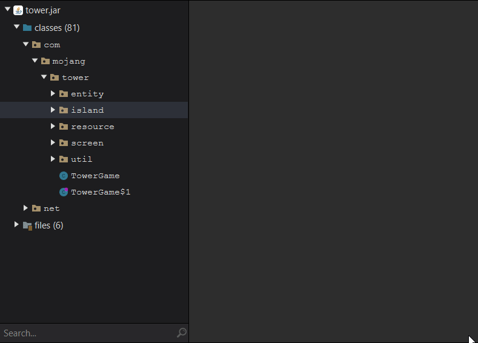

> ## NOTE: This is a plugin for Recaf 2.X
> This feature is built into later versions of Recaf 4.X

# Recaf Plugin: Batch Decompile

This plugin adds a context menu to classes, packages, and the root item of the workspace navigator panel. It allows you to decompile multiple classes at once into a jar/zip file to a location of your choosing.

## Download: [Here](https://github.com/Recaf-Plugins/Batch-Decompile/releases)
